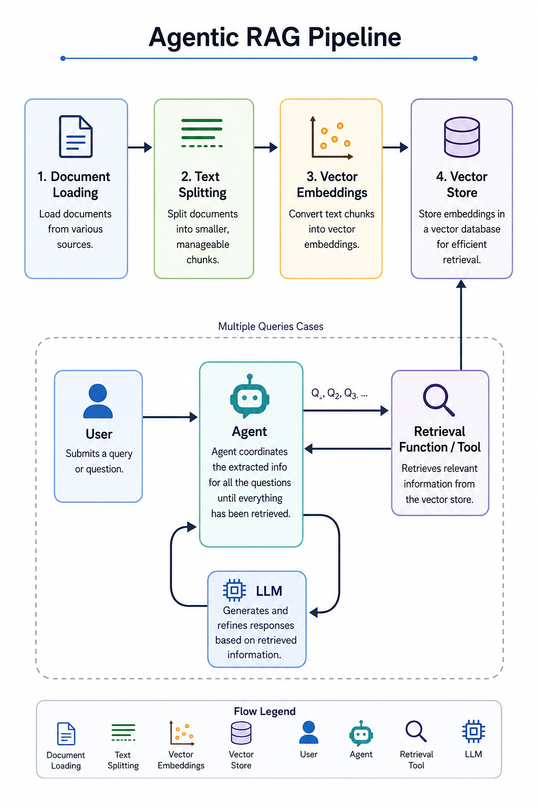

# 📄 DocChat — Agentic RAG PDF Assistant

DocChat is an **agentic Retrieval-Augmented Generation (RAG) application** that allows users to upload one or more PDF documents and interact with them through natural-language questions.

The application processes uploaded PDFs, splits their content into smaller chunks, generates vector embeddings, stores them in an in-memory vector store, and uses an LLM-powered agent to retrieve relevant information before generating an answer.

## ✨ Features

* 📂 Upload multiple PDF documents
* 🔍 Semantic retrieval from uploaded documents
* 🤖 LLM-powered agent for answering questions
* 🧠 Conversation memory using LangGraph
* 📑 Automatic PDF loading and text chunking
* ⚡ In-memory vector store for document retrieval
* 📊 Displays document processing statistics
* 🗑️ Clear uploaded documents and reset the session
* 🎨 Custom Streamlit interface with a chat-based UI

## 🏗️ System Architecture

<p align="center">
  
</p>

## 🔧 Tech Stack

* **Python**
* **Streamlit** — web interface
* **LangChain** — document processing and agent tooling
* **LangGraph** — conversation checkpointing and memory
* **Groq** — LLM inference
* **Hugging Face Sentence Transformers** — document embeddings
* **InMemoryVectorStore** — vector storage
* **PyPDFDirectoryLoader** — PDF loading

## 📁 Project Structure

```text
AGENTIC-RAG-PDF/
│
├── data/
│   └── docs/              # Uploaded PDFs (ignored by Git)
│
├── pipeline.png           # System architecture flowchart
├── .env                   # API keys and environment variables
├── .gitignore
├── main.py                # Main Streamlit application
├── pyproject.toml
├── requirements.txt
├── uv.lock
└── README.md
```

Uploaded PDF files are stored in `data/docs/`. The directory is automatically created by the application when it does not exist.

## 🚀 Getting Started

### 1. Clone the repository

```bash
git clone https://github.com/your-username/AGENTIC-RAG-PDF.git
cd AGENTIC-RAG-PDF
```

### 2. Create a virtual environment

```bash
python -m venv .venv
```

Activate it:

**Windows**

```bash
.venv\Scripts\activate
```

**Linux/macOS**

```bash
source .venv/bin/activate
```

### 3. Install dependencies

```bash
pip install -r requirements.txt
```

### 4. Configure environment variables

Create a `.env` file in the project root and add your Groq API key:

```env
GROQ_API_KEY=your_api_key_here
```

Do not commit your `.env` file to GitHub.

### 5. Run the application

```bash
streamlit run main.py
```

The application will open in your browser.

## 💬 Using DocChat

1. Upload one or more PDF files from the sidebar.
2. Click **Process**.
3. Wait for the documents to be processed and indexed.
4. Ask questions about the uploaded documents through the chat interface.
5. Continue the conversation naturally using the chat interface.

The application retrieves relevant information from the uploaded documents for each question and uses that context to generate the response.

## 🧠 Document Processing

The application uses:

* `PyPDFDirectoryLoader` to load PDFs.
* `RecursiveCharacterTextSplitter` to divide documents into smaller chunks.
* `all-MiniLM-L6-v2` to generate document embeddings.
* `InMemoryVectorStore` for storing and searching the embeddings.
* A retrieval tool to perform similarity searches.
* An LLM-powered agent to generate answers based on retrieved document context.

## 🔐 Environment Variables

| Variable       | Description                         |
| -------------- | ----------------------------------- |
| `GROQ_API_KEY` | API key used for Groq LLM inference |

Keep API keys private and never commit them to the repository.

## 📌 Current Limitations

* The vector store is **in-memory**, so the document index is rebuilt when the application is restarted.
* Uploaded PDF files are stored locally.
* The application currently focuses on PDF-based question answering.
* Document retrieval depends on the quality of the text extracted from the PDFs.

## 📜 License

This project is available for learning and personal use.
